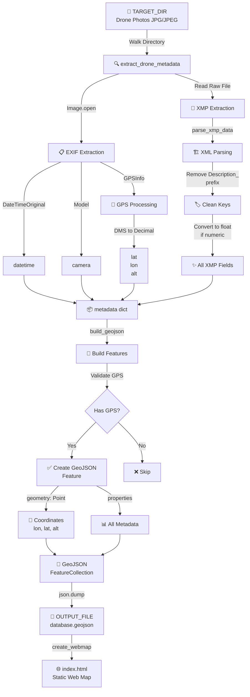

# DAPM
It scans recursively into folders to find Drone Aerial Photos and builds a webMap with locations and other data.

```bash
pip install Pillow
```
----
# Project Documentation: from Drone Aerial Photos to webMap

## 1. Project Overview
This project is a Geographic Information System (GIS) tool designed to index, visualize, and analyze drone aerial photography. The system allows users to view drone flight paths on an interactive map, filter photos by time, and export selected data.

## 2. Architecture
The system is built as a static file generator utilizing Python for data processing and a combination of JavaScript libraries for the frontend interface.

* **Data Processing (Python):** A standalone script (`dapm.py`) using `Pillow` and XML parsing to recursively scan directories of drone images, extracting GPS coordinates, timestamps, and all available XMP metadata (Yaw, Gimbal Pitch, etc.).
* **Frontend (JavaScript/HTML):** The Python script generates a standalone `index.html` file that utilizes **Leaflet.js** for map rendering, **Turf.js** for spatial calculations, **noUiSlider** for time filtering, and **Leaflet.Draw** for user selection.

## 2.1 Data Flow Architecture



## 3. Data Model (GeoJSON)
The core database is a static GeoJSON `FeatureCollection`. Each photo is represented as a `Point` feature with dynamic properties extracted from the image:

```json
{
  "type": "Feature",
  "geometry": {
    "type": "Point",
    "coordinates": [ <Longitude>, <Latitude>, <Altitude> ]
  },
  "properties": {
    "filename": "DJI_0001.JPG",
    "filepath": "/path/to/drones/DJI_0001.JPG",
    "datetime": "2026-04-05 14:30:00",
    "camera": "FC3170",
    "FlightYawDegree": 14.5,
    "GimbalPitchDegree": -90.0
  }
}
```

## 4. Core Features

### 4.1 Map Visualization & Layer Control
* Loads an OpenStreetMap base tile layer.
* Parses the GeoJSON file and renders the drone's photo locations as point markers.
* Markers are dynamically colored based on their relative altitude using a terrain colormap gradient (Brown -> Tan -> Light Green -> Light Grey -> White).
* Includes a horizontal altitude legend at the bottom left of the map.

### 4.2 Time Slice Filter
* Features a dual-handle UI slider in the top right corner to filter markers based on their timestamp.
* The slider automatically detects the minimum and maximum dates from the dataset and updates the visible points and photo count dynamically.

### 4.3 Data Popups
* Clicking on a drone marker opens a Leaflet popup.
* The popup displays the filename, timestamp, camera model, altitude, gimbal pitch, drone yaw, GPS coordinates, and a button to view the local filepath.

### 4.4 Area Selection & Data Export
* Users can use the "Select by Rectangle & Export CSV" button to draw a bounding box on the map.
* The system identifies all *currently visible* markers (respecting the time filter) within the drawn rectangle.
* It automatically compiles the metadata of the selected features and triggers a client-side download of a CSV file (`drone_selection_export.csv`).

### 4.5 Statistics Panel
* A panel in the bottom right corner displays real-time statistics, including the total number of processed photos and the absolute altitude range in meters.