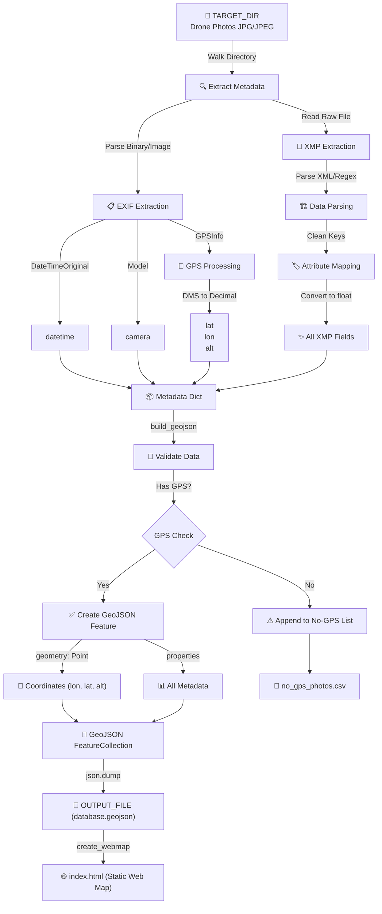

# DAPM: from *D*rone *A*erial *P*hotos to web*M*ap

A file scanner for Drone Aerieal Photos metadata that produce a webmap with you can interact for time and location based searches.

## Output field reference

See [OUTPUT_FIELDS.md](OUTPUT_FIELDS.md) for the schema-2 field definitions shared by the Go and Python implementations, including namespace rules, units, examples, missing-value rules, and official references. [OUTPUT_SCHEMA.json](OUTPUT_SCHEMA.json) is the machine-readable JSON Schema for GeoJSON and shapefile field-mapping sidecars. Existing exports affected by the metadata bugs must be regenerated from the original JPEGs.

## Quick Start

1. Edit <code>src/golang/input.yaml</code>.
2. Run the Windows executable:

~~~powershell
.\build\dapm.exe .\src\golang\input.yaml
~~~

This loads the YAML settings, scans JPG/JPEG files, extracts GPS and EXIF/XMP metadata, and generates all schema-2 outputs.


## Repository layout

~~~text
DAPM/
├── README.md
├── LICENSE
├── CITATION
├── OUTPUT_FIELDS.md
├── OUTPUT_SCHEMA.json
├── build/
│   ├── dapm.exe
│   ├── dapm-mac-intel
│   ├── dapm-mac-arm64
│   └── template.html
└── src/
    ├── golang/
    │   ├── main.go
    │   ├── exports.go
    │   ├── metadata_test.go
    │   ├── go.mod
    │   ├── build_it.bat
    │   └── input.yaml
    └── python/
        ├── dapm.py
        ├── test_dapm.py
        ├── requirements.txt
        ├── input-test.yaml
        └── environment/
~~~

## 🚀 Available Versions

This project is available in two implementations:

1. **Python:** The standard version utilizing `Pillow` for image processing.
2. **Go (Golang):** A blazingly fast, zero-dependency alternative that uses only the standard library.

---
How to cite:
```Latex
@misc{dapm_tool,
  author = {Di Pietro, Gianfranco},
  title = {DAPM: From Drone Aerial Photos to webMap},
  year = {2026},
  publisher = {GitHub},
  journal = {GitHub repository},
  howpublished = {\url{https://github.com/gianfrancodp/DAPM}},
  note = {Accessed: 2026-09-13}
}
```
---

## 🛠️ Direct Usage

For Windows, keep <code>dapm.exe</code> and <code>template.html</code> together. The repository already places them in <code>build</code>. Edit <code>src/golang/input.yaml</code> and run:

~~~powershell
.\build\dapm.exe .\src\golang\input.yaml
~~~

The generated files are <code>index.html</code>, the configured GeoJSON, the matching CSV and shapefile components, the DBF <code>.fields.json</code> mapping, and <code>no_gps_photos.csv</code> when photographs lack valid EXIF coordinates.

## Compile and run

### Step 1: Clone the repository

~~~bash
git clone https://github.com/gianfrancodp/DAPM
cd DAPM
~~~

### Step 2: Configure

Both implementations use YAML. Go includes <code>src/golang/input.yaml</code>; Python includes <code>src/python/input-test.yaml</code>. Set <code>TARGET_DIR</code>, <code>OUTPUT_FILE</code>, <code>MAP_TITLE</code>, and <code>AUTHOR</code>.

### Step 3: Run Python

Create the environment in its designated folder, install the manifest, and run the script:

~~~powershell
python -m venv .\src\python\environment
.\src\python\environment\Scripts\Activate.ps1
pip install -r .\src\python\requirements.txt
python .\src\python\dapm.py .\src\python\input-test.yaml
~~~

### Step 4: Build and run Go

The build script writes Windows and macOS executables to <code>build</code>:

~~~powershell
.\src\golang\build_it.bat
.\build\dapm.exe .\src\golang\input.yaml
~~~

### Step 5: View the Results

1. Open the generated `index.html` file in your web browser (located in the same folder as your output GeoJSON).
2. Explore the interactive map with your drone photo locations.
3. Check the target directory for an additional `no_gps_photos.csv` file if any photos were missing location data.

---

## 1. Project Overview

This project is a Geographic Information System (GIS) tool designed to index, visualize, and analyze drone aerial photography. The system allows users to view drone flight paths on an interactive map, filter photos by time, and export selected data.

## 2. Architecture

The system is built as a static file generator utilizing Python or Go for data processing, and a combination of JavaScript libraries for the frontend interface.

* **Data Processing:** <code>src/python/dapm.py</code> and <code>src/golang/main.go</code> recursively scan drone images and extract EXIF GPS, timestamps and namespace-aware XMP metadata.
* **Frontend (JavaScript/HTML):** <code>build/template.html</code> generates a standalone <code>index.html</code> using **Leaflet.js**, **noUiSlider** and **Leaflet.Draw**.

### 2.1 Data Flow Architecture


```mermaid
graph TD
    A["📁 TARGET_DIR<br/>Drone Photos JPG/JPEG"] -->|Walk Directory| B["🔍 Extract Metadata"]
    
    B -->|Parse Binary/Image| C["📋 EXIF Extraction"]
    C -->|DateTimeOriginal| D["datetime"]
    C -->|Model| E["camera"]
    C -->|GPSInfo| F["📍 GPS Processing"]
    F -->|DMS to Decimal| G["lat<br/>lon<br/>alt"]
    
    B -->|Read Raw File| H["🔎 XMP Extraction"]
    H -->|Parse XML/Regex| I["🏗️ Data Parsing"]
    I -->|Clean Keys| J["🏷️ Attribute Mapping"]
    J -->|Convert to float| K["✨ All XMP Fields"]
    
    D --> L["📦 Metadata Dict"]
    E --> L
    G --> L
    K --> L
    
    L -->|build_geojson| M["🎯 Validate Data"]
    M -->|Has GPS?| N{GPS Check}
    
    N -->|Yes| O["✅ Create GeoJSON Feature"]
    O -->|geometry: Point| Q["📍 Coordinates (lon, lat, alt)"]
    O -->|properties| R["📊 All Metadata"]
    Q --> S["💾 GeoJSON FeatureCollection"]
    R --> S
    S -->|json.dump| T["📄 OUTPUT_FILE (database.geojson)"]
    
    N -->|No| P["⚠️ Append to No-GPS List"]
    P --> V["📄 no_gps_photos.csv"]

    T -->|create_webmap| U["🌐 index.html (Static Web Map)"]

```

## 3. Data Model (GeoJSON)

The core database is a static GeoJSON `FeatureCollection`. Each photo is represented as a `Point` feature with dynamic properties extracted from both EXIF and XMP headers:

```json
{
  "type": "Feature",
  "geometry": {
    "type": "Point",
    "coordinates": [ 12.4922, 41.8902, 120.5 ]
  },
  "properties": {
    "filename": "DJI_0001.JPG",
    "filepath": "/path/to/drones/DJI_0001.JPG",
    "relative_filepath": "DJI_0001.JPG",
    "dapm_version": "1.1.2",
    "dapm_schema_version": "2",
    "datetime": "2026-04-05 14:30:00",
    "xmp_tiff_Model": "FC3170",
    "xmp_drone_dji_FlightYawDegree": 14.5,
    "xmp_drone_dji_GimbalPitchDegree": -90.0
  }
}

```

## 4. Core Features

### 4.1 Map Visualization & Layer Control

* **Dual Basemaps:** Users can toggle between *OpenStreetMap* and *Bing Aerials* using the top-right layer control.
* **Dynamic Styling:** Parses the GeoJSON file and renders drone photo locations as point markers.
* **Altitude Colormap:** Markers are dynamically colored based on their relative altitude using a terrain gradient (`Blue -> Green -> Yellow -> Orange -> Red`).
* **Legend:** Includes a horizontal altitude legend at the bottom left of the map to decode the colormap easily.

### 4.2 Time Slice Filter

* Features a dual-handle UI slider in the top right corner to filter markers based on their timestamp.
* The slider automatically detects the minimum and maximum dates from the dataset and updates the visible points and photo count dynamically.

### 4.3 Data Popups

* Clicking on a drone marker opens a Leaflet popup.
* The popup displays an image preview, filename, timestamp, camera model, altitude, GPS coordinates, and a button to view the local filepath.

### 4.4 Area Selection & Data Export

* Users can use the "Select by Rectangle & Export CSV" button to draw a bounding box on the map.
* The system identifies all *currently visible* markers (respecting the time filter) within the drawn rectangle.
* It automatically compiles the dynamic metadata of the selected features and triggers a client-side download of a CSV file (`drone_selection_export.csv`).

### 4.5 Unmapped Photos Handling (No-GPS Export)

* If the script encounters drone photos missing valid GPS coordinates, it does not discard them.
* Instead, it automatically aggregates their metadata and exports a separate `no_gps_photos.csv` file into the target directory, ensuring no photographic asset is lost from the database.

### 4.6 Statistics Panel

* A panel in the bottom right corner displays real-time statistics, including the total number of valid mapped photos and the absolute altitude range in meters.

## Credits and Acknowledgments

This project ("DAPM") is made possible thanks to the open-source community. Below is a list of the third-party libraries and frameworks used:

### Go Backend
The Go component of this project is built entirely using the Go Standard Library and has **zero external dependencies**.

### Python Scripts
* **[PyYAML](https://pyyaml.org/)** - Used for YAML parsing and emitting. 
  * *License:* MIT License
  * *Author:* Kirill Simonov and PyYAML contributors
* **[Pillow](https://python-pillow.org/)** - A friendly Python Imaging Library (PIL) fork, used for image and EXIF data processing.
  * *License:* HPND License
  * *Author:* Alex Clark and contributors

### Frontend (HTML / CSS / JS)
* **[Leaflet](https://leafletjs.com/)** - An open-source JavaScript library for mobile-friendly interactive maps.
  * *License:* BSD 2-Clause License
  * *Author:* Vladimir Agafonkin and contributors
* **[Leaflet.draw](https://github.com/Leaflet/Leaflet.draw)** - A plugin for Leaflet that adds support for drawing and editing vectors and polygons on the map.
  * *License:* MIT License
  * *Author:* Jacob Toye, Jonatan Heyman, and contributors
* **[noUiSlider](https://refreshless.com/nouislider/)** - A lightweight, customizable JavaScript range slider.
  * *License:* MIT License
  * *Author:* Léon Gersen
