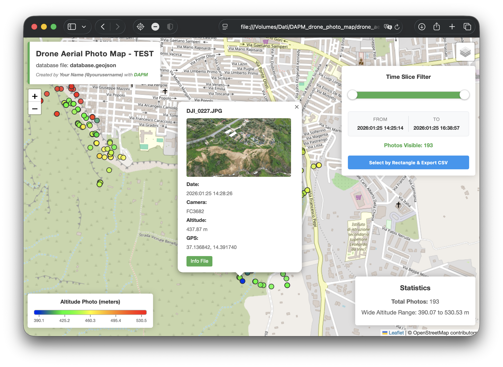
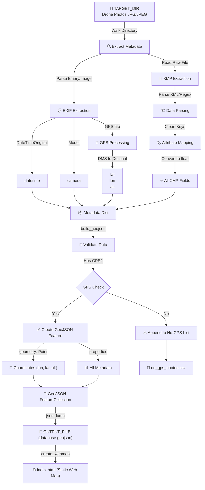

# DAPM: from *D*rone *A*erial *P*hotos to web*M*ap

It scans recursively into folders to find Drone Aerial Photos and builds a webMap with locations and other data.



## 🚀 Available Versions

This project is available in two implementations:

1. **Python:** The standard version utilizing `Pillow` for image processing.
2. **Go (Golang):** A blazingly fast, zero-dependency alternative that uses only the standard library.

---

## 🛠️ Usage

### Step 1: Clone the Repository

Clone this repository to your local machine:

```bash
git clone https://github.com/gianfrancodp/DAPM
cd DAPM

```

### Step 2: Configuration (Both Versions)

Both the Python and Go versions rely on a simple YAML configuration file (e.g., `input-test.yaml`). Open it in your text editor and update the following variables:

* `TARGET_DIR`: Path to the directory containing your drone aerial photos (supports recursive scanning).
* `OUTPUT_FILE`: Path where the GeoJSON database will be saved.
* `MAP_TITLE`: Title for the generated web map.
* `AUTHOR`: Your name and optional social media handle.

### Step 3: Run the Script

#### Option A: Using Python

**Prerequisites:** Python 3.6+

1. Create and activate a virtual environment:
```bash
python -m venv .
source bin/activate  # On Windows: bin\activate

```


2. Install dependencies:
```bash
pip install Pillow pyyaml

```


3. Run the script:
```bash
python dapm.py

```


#### Option B: Using Go (Zero Dependencies)

**Prerequisites:** Go installed on your system.

1. Build the executable:
```bash
go build -o dapm .

```


2. Run the executable passing the configuration file as an argument:
```bash
./dapm input-test.yaml

```


### Step 4: View the Results

1. Open the generated `index.html` file in your web browser (located in the same folder as your output GeoJSON).
2. Explore the interactive map with your drone photo locations.
3. Check the target directory for an additional `no_gps_photos.csv` file if any photos were missing location data.

---

## 1. Project Overview

This project is a Geographic Information System (GIS) tool designed to index, visualize, and analyze drone aerial photography. The system allows users to view drone flight paths on an interactive map, filter photos by time, and export selected data.

## 2. Architecture

The system is built as a static file generator utilizing Python or Go for data processing, and a combination of JavaScript libraries for the frontend interface.

* **Data Processing:** A standalone script (`dapm.py` or `main.go`) that recursively scans directories of drone images, extracting EXIF GPS coordinates, timestamps, and all available XMP metadata (Yaw, Gimbal Pitch, etc.).
* **Frontend (JavaScript/HTML):** The script generates a standalone `index.html` file that utilizes **Leaflet.js** for map rendering, **noUiSlider** for time filtering, and **Leaflet.Draw** for user selection.

### 2.1 Data Flow Architecture


```mermaid
graph TD
    A["📁 TARGET_DIR<br/>Drone Photos JPG/JPEG"] -->|Walk Directory| B["🔍 Extract Metadata"]
    
    B -->|Parse Binary/Image| C["📋 EXIF Extraction"]
    C -->|DateTimeOriginal| D["datetime"]
    C -->|Model| E["camera"]
    C -->|GPSInfo| F["📍 GPS Processing"]
    F -->|DMS to Decimal| G["lat<br/>lon<br/>alt"]
    
    B -->|Read Raw File| H["🔎 XMP Extraction"]
    H -->|Parse XML/Regex| I["🏗️ Data Parsing"]
    I -->|Clean Keys| J["🏷️ Attribute Mapping"]
    J -->|Convert to float| K["✨ All XMP Fields"]
    
    D --> L["📦 Metadata Dict"]
    E --> L
    G --> L
    K --> L
    
    L -->|build_geojson| M["🎯 Validate Data"]
    M -->|Has GPS?| N{GPS Check}
    
    N -->|Yes| O["✅ Create GeoJSON Feature"]
    O -->|geometry: Point| Q["📍 Coordinates (lon, lat, alt)"]
    O -->|properties| R["📊 All Metadata"]
    Q --> S["💾 GeoJSON FeatureCollection"]
    R --> S
    S -->|json.dump| T["📄 OUTPUT_FILE (database.geojson)"]
    
    N -->|No| P["⚠️ Append to No-GPS List"]
    P --> V["📄 no_gps_photos.csv"]

    T -->|create_webmap| U["🌐 index.html (Static Web Map)"]

```

## 3. Data Model (GeoJSON)

The core database is a static GeoJSON `FeatureCollection`. Each photo is represented as a `Point` feature with dynamic properties extracted from both EXIF and XMP headers:

```json
{
  "type": "Feature",
  "geometry": {
    "type": "Point",
    "coordinates": [ 12.4922, 41.8902, 120.5 ]
  },
  "properties": {
    "filename": "DJI_0001.JPG",
    "filepath": "/path/to/drones/DJI_0001.JPG",
    "relative_filepath": "DJI_0001.JPG",
    "datetime": "2026-04-05 14:30:00",
    "camera": "FC3170",
    "FlightYawDegree": 14.5,
    "GimbalPitchDegree": -90.0
  }
}

```

## 4. Core Features

### 4.1 Map Visualization & Layer Control

* **Dual Basemaps:** Users can toggle between *OpenStreetMap* and *Bing Aerials* using the top-right layer control.
* **Dynamic Styling:** Parses the GeoJSON file and renders drone photo locations as point markers.
* **Altitude Colormap:** Markers are dynamically colored based on their relative altitude using a terrain gradient (`Blue -> Green -> Yellow -> Orange -> Red`).
* **Legend:** Includes a horizontal altitude legend at the bottom left of the map to decode the colormap easily.

### 4.2 Time Slice Filter

* Features a dual-handle UI slider in the top right corner to filter markers based on their timestamp.
* The slider automatically detects the minimum and maximum dates from the dataset and updates the visible points and photo count dynamically.

### 4.3 Data Popups

* Clicking on a drone marker opens a Leaflet popup.
* The popup displays an image preview, filename, timestamp, camera model, altitude, GPS coordinates, and a button to view the local filepath.

### 4.4 Area Selection & Data Export

* Users can use the "Select by Rectangle & Export CSV" button to draw a bounding box on the map.
* The system identifies all *currently visible* markers (respecting the time filter) within the drawn rectangle.
* It automatically compiles the dynamic metadata of the selected features and triggers a client-side download of a CSV file (`drone_selection_export.csv`).

### 4.5 Unmapped Photos Handling (No-GPS Export)

* If the script encounters drone photos missing valid GPS coordinates, it does not discard them.
* Instead, it automatically aggregates their metadata and exports a separate `no_gps_photos.csv` file into the target directory, ensuring no photographic asset is lost from the database.

### 4.6 Statistics Panel

* A panel in the bottom right corner displays real-time statistics, including the total number of valid mapped photos and the absolute altitude range in meters.